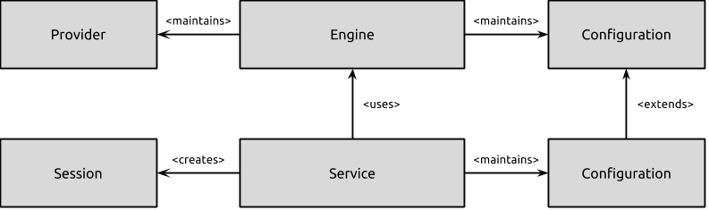

# Architecture

This describes the architecture of the locationd service and gives
an overview of how it works internally.

## Vocabulary

To make the remainder of this documentation easy to understand, some
new terminology is defined:

 - `Engine`: Responsible for handling input from multiple positioning
   subsystems and maintaining the state of the overall system. Think
   about it like the heart of the system.

 - `Provider`: A positioning subsystem that feeds into the positioning
   engine. Common examples are a GPS provider or a network-based
   positioning provider.

 - `Service`: The point of entry for applications and services that would
   like to receive position data.

 - `Session`: In order to receive position information, every application
   or service has to create a session with the location Service.
   Session creation is subject to security mediation and contextual
   prompting.

 - `Update`: An update is a timestamped entity containing a location,
   heading or velocity.

 - [WGS84](http://en.wikipedia.org/wiki/World_Geodetic_System): The coordinate system that is used throughout the entire location subsystem.

## Architecture Overview

The high-level architecture of the service is shown in the following diagram:

In this diagram, the configuration of the engine refers to:

  * The current state of any satellite-based positioning subsystems. Can
    either be off or on.
  * The current state of reporting facilities responsible for harvesting wifi
    and cell id measurements together with location information and sending
    them off to remote services. Can either be off or on.
  * The overall state of the engine. Can either be off, on or active.

The Service takes this configuration and exposes it to client
applications. In addition, mainly for debugging purposes, the set of
currently visible satellites (if any) is maintained and exposed to
privileged client applications. The service supports multiple different
satellite-based positioning operations in parallel. The following GNSSs
are known:

| Name   | Description |
|--------|-------------|
| Beidou | People's Republic of China's regional system, currently limited to Asia and the West Pacific.|
| Galileo | A global system being developed by the European Union and other partner countries, planned to be operational by 2014 (and fully deployed by 2019). |
| Gloanass | Russia's global navigation system. Fully operational worldwide. |
| GPS | Fully operational worldwide. |
| Compass | People's Republic of China's global system, planned to be operational by 2020. |
| IRNSS | India's regional navigation system, planned to be operational by 2014, covering India and Northern Indian Ocean. |
| QZSS | Japanese regional system covering Asia and Oceania. |

!!! Note:
    Which GNSS systems are supported on your system depends on the
    chipset being used.
